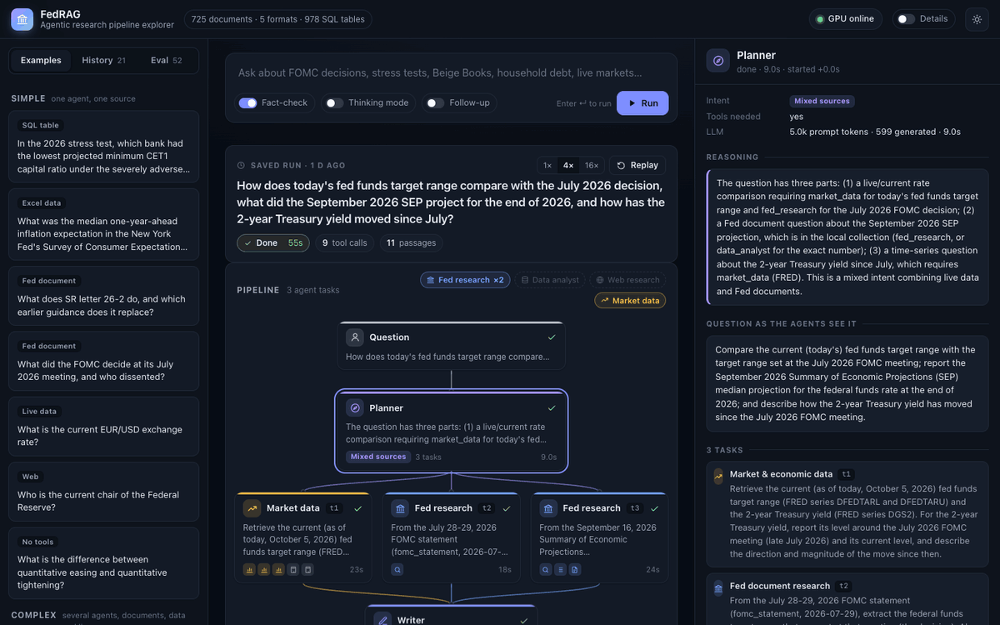
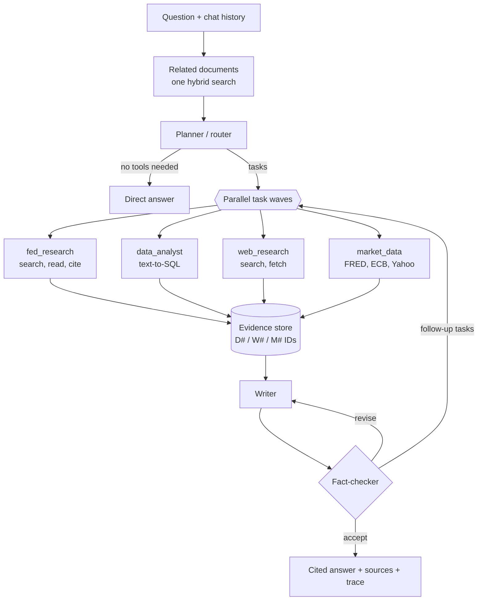
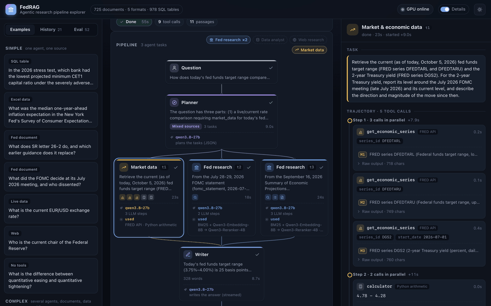
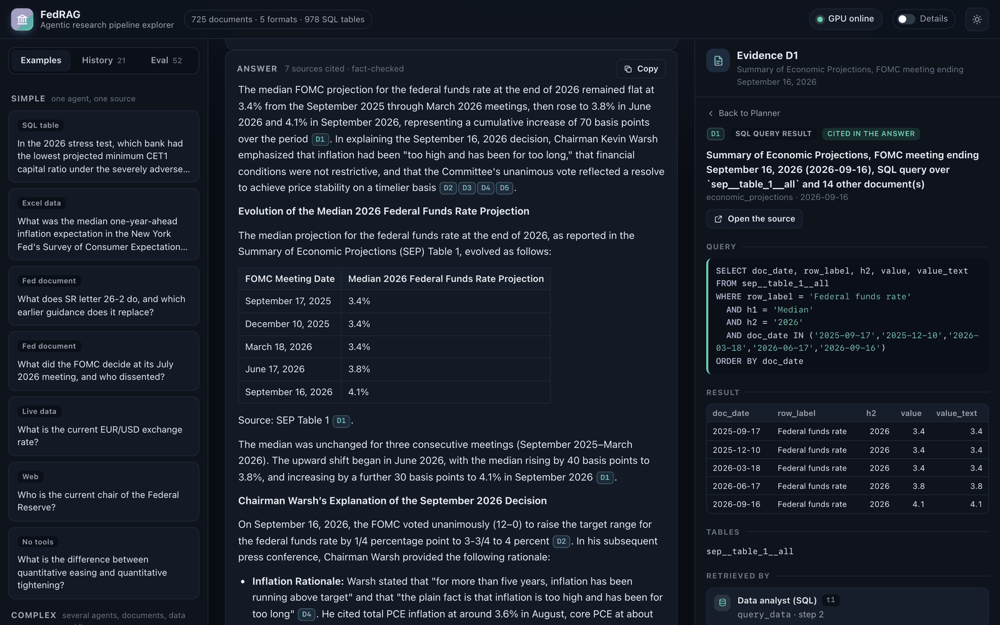
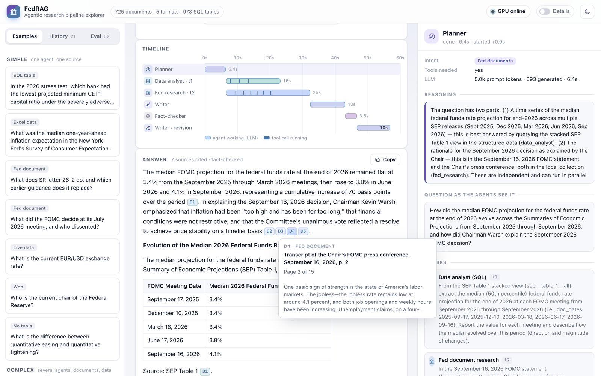
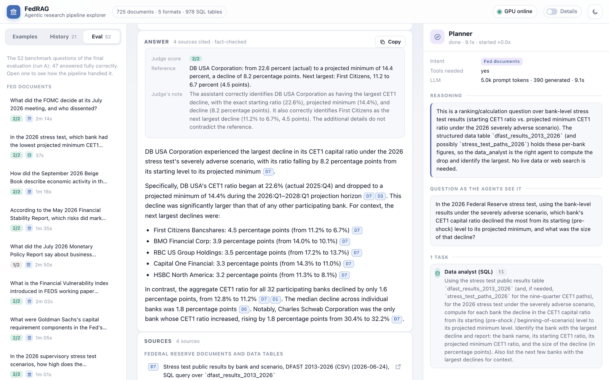

# FedRAG: agentic research over the Federal Reserve's documents

[](https://github.com/atahanuz/fedrag/actions/workflows/tests.yml)


[](LICENSE)

A multi-agent retrieval-augmented generation (RAG) system that answers questions over **725 Federal Reserve
documents in five formats**: PDF, web pages, Word, Excel and CSV. It runs **SQL over 978 tables** extracted
from those files, searches the web and pulls **live market data**. Every fact in an answer is cited and the
answer is fact-checked before it is returned. All models are open-weight and self-hosted on one GPU. A web
GUI, the **pipeline explorer**, shows each run step by step.



<sub>A recorded run, replayed at 4× speed. The planner splits the question into three parallel tasks: FRED
data and two Fed documents. The fact-checker finds one problem in the draft and sends it back for a
revision.</sub>

## Highlights

- **Agentic, not one-shot.** A planner routes each question and splits it into parallel tasks for four
  specialist agents. The agents are ReAct loops with **19 tools**: document search, text-to-SQL, web
  search, FRED, ECB and Yahoo Finance. A writer cites every fact. A verifier checks the draft and asks for a
  revision or for more research.
- **One index for every format.** Each format has its own parser, and all of them produce the same
  structure. Tables inside spreadsheets, web pages and Word files become **DuckDB tables**: multi-row
  headers, merged cells and row groups are handled. A data agent queries them in a read-only SQL sandbox.
- **Hybrid retrieval.** BM25 and dense search (Qwen3-Embedding-8B) are fused with reciprocal rank fusion
  and reranked by Qwen3-Reranker-4B. A set-aware search reads *every* member of a document set, such as each
  2025 FOMC statement. Embeddings are incremental.
- **Measured, not claimed.** An LLM-judged benchmark of 52 questions compares the system with a naive-RAG
  baseline. A harder set of 24 questions covers multi-source, ambiguous and broad questions, and two models
  are compared. Every answer, verdict and trace is committed in [`eval/results/`](eval/results).
- **Observable.** The explorer streams each run as NDJSON. It shows the agent graph, a timeline of parallel
  work, every tool call and SQL query, and a preview of the passage behind each citation. Runs can be
  replayed.
- **Self-hosted.** Qwen3.8-27B (FP8), the embedder and the reranker share one A100 80GB, served with vLLM.
  No proprietary API keys are needed.

## Results

| Benchmark | FedRAG | Baseline |
| --- | :---: | :---: |
| **52 questions, 11 categories**<br><sub>Fed documents, SQL over spreadsheets, Word, web pages, live data, web, mixed, chit-chat</sub> | **90% / 92%** fully correct<br><sub>two runs · 100% routing · every tool-based answer cited</sub> | 42%<br><sub>naive RAG, same retrieval and LLM</sub> |
| &nbsp;&nbsp;↳ structured data (Excel / CSV through SQL) | **100% / 100%** | 33% |
| &nbsp;&nbsp;↳ comparisons across documents | **100% / 100%** | 25% |
| **24 harder questions**<br><sub>many sources, ambiguous, broad</sub> | **56%** fully correct<br><sub>mean score 0.77</sub> | 48% (0.72)<br><sub>the pipeline before the changes for these questions</sub> |
| **Choice of LLM**, same pipeline, 52 questions | **Qwen3.8-27B: 91%** | Gemma 4 31B: 72%<br><sub>about 81% after a hand check of the judge</sub> |

"Fully correct" means the LLM judge gave 2 of 2 points against a reference answer written from the source
documents. The first benchmark ran on the 391-document collection. On the current 725 documents, the same
questions score 46 of 52 (88%). Method, per-category tables and error analysis are in
[docs/evaluation.md](docs/evaluation.md); the dated log of every change and measurement is in
[docs/findings.md](docs/findings.md).

## How it works



1. **Planner.** Its input is today's date, a description of the collection and the documents most related to
   the question. It classifies the question and rewrites a follow-up as a standalone question. It splits the
   work into tasks, some parallel and some dependent, and returns a JSON-schema-constrained plan. For an
   ambiguous question ("Who dissented?") it records how it reads it, and the answer states that reading.
2. **Specialist agents.** Each is a ReAct loop over native function calling. When the model calls several
   tools in one turn, they run concurrently. Each agent finishes by submitting its findings: cited facts, a
   confidence level and any gaps.
3. **Writer and fact-checker.** The writer drafts the answer with an inline citation on every fact; a SQL
   result is cited like a page. The fact-checker checks support, completeness, dates and arithmetic. It then
   accepts the draft, asks for a revision, or starts another round of research.

More in [docs/architecture.md](docs/architecture.md): ingestion of each format, the table engine, retrieval,
the SQL sandbox and model serving.

## Pipeline explorer

| | |
| :---: | :---: |
| [](docs/images/details.png) | [](docs/images/evidence.png) |
| **Details switch.** What runs in each step: the LLM and its role, or each tool and the service behind it. | **Evidence.** Every citation opens its evidence. Here, the SQL query and the rows behind `[D1]`. |
| [](docs/images/answer.png) | [](docs/images/eval.png) |
| **Timeline and answer.** When each agent and tool call ran; hovering a citation previews its source passage. | **Eval tab.** Opens all 52 benchmark runs, each with the judge's score, the reference answer and the full trace. |

`fedrag ui` starts it on `http://127.0.0.1:7860`. It has 18 example questions, from single-source lookups to
questions that need several agents and formats. History, Replay and the Eval tab work offline, without the
GPU.

## Tech stack

| Layer | Tools |
| --- | --- |
| LLM serving | vLLM 0.31, `Qwen/Qwen3.8-27B-FP8`<br><sub>MTP speculative decoding, xgrammar structured outputs, 64K context</sub> |
| Retrieval | `Qwen3-Embedding-8B`, `Qwen3-Reranker-4B`, BM25 (sparse matrices), reciprocal rank fusion |
| Agents | Custom ReAct loop on OpenAI-compatible function calling, asyncio for parallel tasks and tools, JSON-schema plans |
| Ingestion | PyMuPDF (layout-aware), BeautifulSoup and lxml, python-docx, openpyxl / xlrd, a table engine for multi-row headers |
| Structured data | DuckDB: read-only, external access disabled, one statement per call, a timeout and a row cap |
| External data | FRED, ECB (Frankfurter), Yahoo Finance, DuckDuckGo and trafilatura |
| App | FastAPI with NDJSON streaming; vanilla-JS single-page app (SVG graph, timeline, no build step) |
| Infrastructure | Colab A100 80GB, FastAPI gateway (auth, embeddings, rerank, LLM proxy), Cloudflare tunnel, keep-alive |
| Quality | 65 offline pytest tests, ruff, GitHub Actions on Python 3.11 and 3.12, LLM-as-judge evaluation harness |

## Engineering notes

Problems found in measurement and how they were fixed. Each one is written up in
[docs/findings.md](docs/findings.md) or [COLAB_GUIDE.md](COLAB_GUIDE.md).

- **Sets of documents were read in part.** A question about "each 2024 Beige Book" lost three of the eight
  to more relevant passages from other documents. A per-document search fixed this: each 2024 Beige Book
  is read in 4.6 s, and the set questions were right in every run.
- **Hidden failures in constrained decoding.** Under JSON-schema decoding, models sometimes padded objects
  with thousands of spaces until the token limit. Gemma's plans and fact-checks hung. Qwen did it now and
  then, and a planner call took 333 s. The fix is to serve every model with xgrammar and
  `disable_any_whitespace`.
- **The tunnel's 100-second limit.** Cloudflare drops a response that takes longer than 100 s. Long LLM calls
  failed, and the client's retries doubled the GPU load. The gateway now sends whitespace every 15 s while a
  call runs, which ended the 524 errors.
- **Colab VMs dying after about 20 minutes.** Measurements showed that only kernel-websocket traffic through
  Colab's proxy counts as activity. A keeper process holds one such websocket, and the CLI's expiring proxy
  token is refreshed.
- **Context overflow.** Long agent runs went past the 64K-token context. Agents now shorten their oldest tool
  results and keep the evidence IDs.
- **Incremental embeddings.** Vectors are keyed by the hash of their text. Growing the corpus from 10,441
  to 15,768 chunks embedded only the 5,327 new ones, in about 6 minutes.

## Quickstart

```bash
git clone https://github.com/atahanuz/fedrag && cd fedrag
uv venv --python 3.12 .venv && uv pip install --python .venv/bin/python -e ".[ui,dev]"

.venv/bin/python scripts/fetch_corpus.py          # download the 725 source files (269 MB, SHA-256 checked)
.venv/bin/python -m fedrag.ingest.build_corpus    # parse into pages, chunks and 978 SQL tables (~20 s)
.venv/bin/python scripts/colab_up.py              # GPU backend on a Colab A100 (LLM, embedder, reranker)

.venv/bin/python -m fedrag ask "What did the FOMC decide in July 2026, and who dissented?"
.venv/bin/python -m fedrag ui                     # the pipeline explorer
.venv/bin/python -m pytest -q                     # offline tests
```

You can skip Colab: set `FEDRAG_LLM_BASE_URL` to any OpenAI-compatible endpoint with tool calling, such as a
local vLLM server. Search then uses BM25 only, because the embedder and reranker run on the GPU gateway.
[docs/setup.md](docs/setup.md) covers the command line, configuration and the GPU backend.

## Documentation

| | |
| --- | --- |
| [docs/architecture.md](docs/architecture.md) | Pipeline, agents and tools, ingestion of each format, retrieval, SQL sandbox, models, repository layout |
| [docs/evaluation.md](docs/evaluation.md) | Benchmarks, the naive-RAG baseline, harder questions, the Qwen and Gemma comparison |
| [docs/findings.md](docs/findings.md) | Dated log of measurements, failures and fixes |
| [docs/setup.md](docs/setup.md) | Setup, command line, pipeline explorer, configuration, limitations |
| [COLAB_GUIDE.md](COLAB_GUIDE.md) | Running vLLM on Colab from the command line: the 80GB A100, keeping sessions alive |
| [federal_reserve/README.md](federal_reserve/README.md) | The document collection: sources, formats and types |

## Repository layout

```
fedrag/        the package: ingest/ (parsers, table engine, chunker), retrieval/ (hybrid search, SQL),
               tools/, agents/ (planner, specialists, writer, verifier), orchestrator.py, cli.py, ui/
gpu_server/    vLLM launcher, FastAPI gateway (auth, embeddings, rerank, LLM proxy), keep-alive
scripts/       collection download, Colab bring-up, LLM switching, session heartbeat
eval/          question sets, evaluation runner and LLM judge, run comparison, committed results
tests/         offline unit tests
```

## License

MIT; see [LICENSE](LICENSE). The documents are public Federal Reserve publications. They are downloaded from
their source URLs and are not stored in this repository. This project is not affiliated with the Federal
Reserve.

Built by [Atahan Uz](https://github.com/atahanuz).
