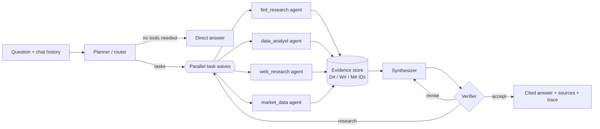

# fedrag — Agentic RAG over a mixed-format Federal Reserve collection

A multi-agent research assistant that answers questions from a collection of **391 Federal Reserve
documents in five formats**: PDF reports, web pages, Word files, Excel workbooks and CSV files, dated 2022 to
October 2026. They include FOMC minutes, statements, projections and press conferences, Beige Books,
Monetary Policy and Financial Stability Reports, stress tests with bank-level results, speeches, testimony,
FEDS Notes and working papers, supervision letters and household and forecaster surveys. The **846 tables**
inside the spreadsheets, CSV files, web pages and Word files are extracted into a SQL database that an agent
queries. The system also handles questions that are only partly about the collection, or not at all:

| Question type | What happens |
| --- | --- |
| What a Fed document says | `fed_research` agent searches, filters, reads pages and tables, and cites them |
| Numbers in the collection's tables (stress-test results by bank, SEP projections across meetings, household debt, survey data) | `data_analyst` agent finds the table, inspects its schema and answers with SQL |
| After the collection ends, or outside it | `web_research` agent searches the web and reads pages |
| Live numbers (FX, fed funds, yields, CPI, prices) | `market_data` agent calls FX / FRED / market APIs and a calculator |
| Several of the above | the planner runs several agents in parallel and the writer merges their findings |
| General knowledge or chit-chat | answered directly by the LLM, no tools |

All models are open-weight and self-hosted on a Colab A100 80GB. No proprietary API keys are needed.

## How it works



1. **Planner (router).** Classifies the question, rewrites follow-ups into standalone questions, and
   decomposes the work into self-contained tasks for specialist agents. It is given today's date, a compact
   description of the collection (types, formats, dates, speakers) and of the main datasets, so it knows
   which agent owns which part and when the collection cannot be enough. It returns a
   JSON-schema-constrained plan. Comparisons over time become parallel tasks, and tasks may depend on each
   other's results.
2. **Specialist agents.** Each one is a ReAct loop over native function calling. In each turn the model
   may call several tools at once; they run concurrently. The agent finishes by calling
   `submit_findings` (answer, cited key facts, confidence, gaps).
   - `fed_research`: `search_fed_documents` (hybrid search with type, date and document filters; it also
     points to related data tables), `find_documents` (which documents discuss a topic),
     `list_fed_documents` (resolves "latest", "the June meeting", "Waller's speeches" and so on),
     `get_document_outline`, `read_document_pages` (whole pages of a PDF, ~600-word parts of a web page or
     Word file, a table preview of a spreadsheet), `expand_context` (neighbouring passages), `calculator`.
   - `data_analyst`: `search_tables` (finds tables by what they measure), `list_tables` (the sheets of a
     workbook, the tables of a page), `describe_table` (columns, units, notes, row labels, header values,
     first rows), `query_data` (read-only DuckDB SQL), plus document search and page reading for
     definitions (the SPF variable codes are only explained in its PDF documentation) and `calculator`.
   - `web_research`: `web_search` (DuckDuckGo, with news and recency filters), `fetch_webpage`
     (HTML or PDF, query-focused extraction), `calculator`.
   - `market_data`: `get_exchange_rate` and `get_exchange_rate_history` (ECB via Frankfurter, with a
     fallback source), `get_economic_series` (FRED, with year-over-year and difference transforms),
     `search_economic_series`, `get_market_prices` (Yahoo via the local `stockcache`), `calculator`.
3. **Corrective step.** If no agent found any evidence, a web-research task is added automatically.
4. **Synthesizer.** Writes the answer from the findings and the evidence excerpts, with an inline
   citation (`[D3]`, `[W2]`, `[M1]`) on every fact. A SQL result is evidence too: the writer and the
   verifier see the query and its rows, and the source list names the table and its document.
5. **Verifier.** Checks support, completeness, date consistency and arithmetic. It returns `accept`,
   `revise` (the synthesizer fixes the listed problems) or `research` (follow-up tasks run, then the answer
   is rewritten).
6. **Output.** The answer, its source list (PDF citations link to the exact page; web pages, Word files
   and data files to their source URL), the plan, every agent's findings and a full trace of tool calls.

### The collection

`federal_reserve/README.md` describes it in detail: 103 PDFs, 264 web pages, 2 Word files, 5 Excel
workbooks (318 sheets) and 17 CSV files; 387 from the Board, 4 from the New York and Philadelphia Feds.
`scripts/fetch_corpus.py --discover` crawled the Board's indexes (press releases, speeches, testimony,
FEDS Notes, SR letters, SLOOS, the FOMC calendar) and a curated list of data files to grow the original 93
PDFs; `metadata.csv` records each file's URL, SHA-256, format, publisher, speaker and, for data files whose
columns are codes, a short data dictionary.

### Ingestion (`fedrag/ingest/`)

Each format has its own parser; all of them produce the same structure (pages of typed paragraphs, an
outline, table blocks), so sectioning, chunking, retrieval and citation work the same way for every file.

- **PDF** (`pdf_parser.py`): a layout-aware PyMuPDF extractor. It rebuilds table rows from span geometry
  (`First Citizens | 6.7`), drops chart axis labels and running headers, removes footnote markers and
  fixes hyphenation. Two-column report pages keep their reading order.
- **Web pages** (`html_parser.py`): finds the article in both federalreserve.gov templates, removes
  navigation, share and video widgets and "Related Content" lists, keeps headings, lists and footnotes in
  reading order, and expands every `<table>` (colspan, rowspan, `<thead>` header rows) into a grid whose
  caption is the preceding "Table N." heading.
- **Word** (`docx_parser.py`): paragraph styles give headings and bullets, tables of contents are dropped,
  tables are read in place. The SCF interview program keeps its routing logic in thousands of one-cell
  code boxes, which are skipped; its answer-category tables become text.
- **Excel and CSV** (`sheet_parser.py`, `tables.py`): chart sheets and license sheets are skipped and
  merged cells are expanded. A table engine then finds each table block on a sheet: title, unit and
  source lines above it, header rows (a label spanning several columns, such as a survey year over
  "Median | Mean", is spread over them), row groups introduced by label-only rows ("Percentile of income"),
  continuation blocks, and notes below. A one-row header gives a **wide** table; a multi-row header gives a
  **long** table (`row_group, row_label, h1..hN, value, value_text`) so that every dimension of a cross-tab
  can be filtered in SQL. Date-like row labels (`26:Q2`, `201306`, year + quarter columns) get a normalised
  `period` column, and repeated labels such as "June projection" are qualified with the row above.
- **Pages and parts.** PDFs keep their pages. Web pages and Word files are split into parts of about
  600 words that break at headings; a spreadsheet has one part per table. Citations say "p. 12" or
  "part 3" accordingly.
- **Sections and chunks** (`chunker.py`): every paragraph gets a section path from the outline plus
  headings detected from the font or markup, for example `Federal Reserve Bank of Chicago > Manufacturing`.
  Chunks of about 260 words never cross a top-level section, so a Beige Book chunk belongs to exactly one
  District: 9,575 prose chunks in all.
- **Tables** (`build_corpus.py`): the 846 table blocks become DuckDB tables, and 20 views stack a table
  that recurs across releases (SEP Table 1 for all 15 meetings since March 2023, stress-test scenarios for
  2024-2026) with `doc_id` and `doc_date` columns. Each table also gets a **table card** for retrieval: its
  title, source, columns with labels and examples, units and notes, the data dictionary, row labels or
  period range, and for small tables the rows themselves (866 cards).

### Retrieval and SQL (`fedrag/retrieval/`)

- **Search** (`index.py`): metadata filter (type, date, document, chunk kind, format), then BM25 (sparse
  matrix) and dense search with **Qwen3-Embedding-8B** (4096-d), fused with reciprocal rank fusion, then
  the top 40 reranked by **Qwen3-Reranker-4B**. Without the GPU it falls back to BM25 only. Document search
  returns prose passages and lists matching table cards as pointers; table search ranks only cards.
- **Embeddings are incremental**: vectors are keyed by the hash of the text they embed, so rebuilding
  the corpus re-embeds only new or changed chunks (the 6,368 chunks of the original PDFs were reused when
  the collection grew to 10,441 chunks). `colab_up.py` runs the batch job for large updates; with the
  gateway already running, `python -m fedrag.retrieval.index embed-missing` embeds a few changed chunks
  through it in seconds.
- **SQL** (`tables.py`): DuckDB opened read-only, with external access disabled and the configuration
  locked, so a query can read the collection's tables and nothing else (no files, network, settings or
  writes). One statement per call, a 20-second timeout and a row cap; DuckDB's error messages go back to
  the agent so it can fix its query.

### Models (all on one A100 80GB)

| Role | Model | Notes |
| --- | --- | --- |
| LLM for every agent | `Qwen/Qwen3.8-27B-FP8` via vLLM 0.30 | tool calling (`qwen3_xml` parser), JSON-schema output, MTP speculative decoding, about 95 tok/s per stream, 64K context, thinking mode off |
| Embeddings | `Qwen/Qwen3-Embedding-8B` | corpus embedded once on the GPU (about 6 min); queries use an instruction prefix |
| Reranker | `Qwen/Qwen3-Reranker-4B` | P("yes") relevance; about 2 s for 40 passages |

Qwen3.8-27B was chosen because it was the strongest instruction-following and agentic model that fits
in 80GB next to the retrieval models (IFBench 79.5, Terminal-Bench 73). FP8 weights run on the A100
through vLLM's Marlin kernels.

## Setup

```bash
# 1. Environment (Python 3.11+)
uv venv --python 3.12 .venv && uv pip install --python .venv/bin/python -e ".[ui,dev]"

# 2. Download the collection (391 files, 199 MB; checks each SHA-256 in federal_reserve/metadata.csv)
.venv/bin/python scripts/fetch_corpus.py            # --discover also looks for new documents

# 3. Parse every document into pages, sections, chunks and SQL tables (about 20 s; writes data/corpus/)
.venv/bin/python -m fedrag.ingest.build_corpus

# 4. Start the GPU server on Colab (see COLAB_GUIDE.md for the high-RAM A100 patch).
#    Creates the session, installs vLLM, downloads models, embeds the chunks that have no embedding yet,
#    starts gateway + vLLM + tunnel + keeper, writes FEDRAG_GPU_URL / FEDRAG_API_KEY to .env, and leaves
#    a heartbeat running in the background.
.venv/bin/python scripts/colab_up.py          # about 15 min on a fresh VM
.venv/bin/python -m fedrag status             # gateway, LLM and index check
```

`scripts/colab_up.py --stop` ends the heartbeat and releases the VM. `--status` shows the serving
stack, the keeper and the heartbeat.

Keeping a Colab VM alive needed measurements (data in
[COLAB_GUIDE.md](COLAB_GUIDE.md#why-sessions-die-and-how-to-keep-them-alive)):

- Colab releases a GPU VM 20-22 minutes after the last kernel-websocket traffic through its proxy.
  Busy servers on the VM do not count, and neither do a busy kernel, HTTP requests through the proxy or
  the CLI's own keep-alive pings. A websocket that the VM opens to its own kernel through its public
  proxy URL does count, so `gpu_server/keeper.py` holds one while the gateway is in use. The VM
  therefore survives the laptop sleeping. After 60 minutes without gateway requests (`--idle-minutes`)
  the keeper lets go, and Colab releases the VM about 20 minutes later.
- `colab-cli` 0.6.0 never refreshes its runtime-proxy token, which expires after an hour. The next
  `colab exec` then gets a 401, and the CLI forgets the session although the VM keeps running.
  `scripts/colab_keepalive.py` refreshes the token before it expires and re-adopts a VM that the CLI
  has already dropped.
- The background heartbeat runs the status cell every 4 minutes. It restarts crashed components,
  hands the keeper fresh tokens, updates `.env` when the tunnel URL changes, and is a second keep-alive
  path. `colab_up.py --keepalive-only` restarts it; its log is `~/.cache/colab-keepalive/fedrag.log`.

For other colab-cli sessions, `python scripts/colab_keepalive.py -s NAME --detach` runs the same
heartbeat and token refresh (without the keeper).

## Usage

```bash
.venv/bin/python -m fedrag ask "What did the FOMC decide in July 2026, and who dissented?"
.venv/bin/python -m fedrag ask -v --save run.json "..."   # show tool results and save the full trace
.venv/bin/python -m fedrag chat                           # multi-turn, follow-up questions work
.venv/bin/python -m fedrag search "CET1 ratio" --type stress_test   # raw retrieval, no agents
.venv/bin/python -m fedrag tables household_debt          # list SQL tables (add --describe NAME for a schema)
.venv/bin/python -m fedrag sql "SELECT period, total FROM nyfed_household_debt_2026q2__page_3_data ORDER BY period DESC LIMIT 4"
.venv/bin/python -m fedrag.ui.app                         # web UI on http://127.0.0.1:7860
```

The web UI streams every agent as a collapsible panel listing its tool calls and findings, and links each
citation to its source.

Real trace (abridged, from the evaluation): a cross-format question. The planner gives the Bulletin (PDF)
to `fed_research` and the Excel tables to `data_analyst`; they run in parallel, and the SQL result is cited
like a page.

```
     planner   13.7s intent=fed_documents tasks=2 — The question asks for two specific data points from the SCF ...
                     • fed_research t1: In the document 'Changes in U.S. Family Finances from 2019 to 2022' ...
                     • data_analyst t2: Query the SCF historical tables for median net worth in 2019 and 2022 ...
fed_research   19.0s   ↳ search_fed_documents({"query": "median family net worth 2019 2022", "doc_types": ["household_survey"]})
data_analyst   19.1s   ↳ search_tables({"query": "median family net worth by year SCF historical", "max_tables": 8})
data_analyst   38.5s   ↳ describe_table({"table": "scf_2022_hist_tables_real__table_4"})
fed_research   38.6s   ↳ get_document_outline({"doc_id": "fed_scf_bulletin_2023-10"})
data_analyst   44.4s   ↳ query_data({"sql": "SELECT h1 AS survey_year, h2 AS statistic, value FROM scf_2022_hist_tables_real__table_4 ..."})
fed_research   52.1s   ↳ read_document_pages({"doc_id": "fed_scf_bulletin_2023-10", "start_page": 17, "end_page": 18})
data_analyst   59.0s ✔ confidence=high evidence=1 steps=4 tools=4
fed_research   62.0s ✔ confidence=high evidence=2 steps=4 tools=5
 synthesizer   62.0s ▶ write the cited answer
    verifier   87.4s verdict=accept
```

> Median family net worth increased by 37 percent, rising from $141,100 in 2019 to $192,900 in 2022 (in 2022
> dollars) [D9][D10]. The SCF historical Excel tables show nearly identical figures: $141,140 in 2019 and
> $192,700 in 2022 [D8]. ...

## Evaluation

`eval/questions.jsonl` has 52 questions in 11 categories, with reference answers taken from the
documents, from the data files (each value checked with SQL against the source file), from live data on
2026-10-04, or from the web. The 20 questions added with the expanded collection cover structured data
(rankings and time series over the stress-test CSVs, the SEP tables, the NY Fed and SPF workbooks), Word
files, web pages (speeches, testimony, SLOOS, SR letters, FEDS Notes, press releases) and answers that
need several formats at once (the SCF Bulletin PDF against its Excel tables; the SEP against the press
conference). `eval/run_eval.py` scores:

- **routing:** every expected agent ran and no forbidden agent ran;
- **correctness:** an LLM judge compares the answer with the reference (2 correct, 1 partial, 0 wrong);
- **grounding:** the share of tool-based answers that carry citations;
- **cost:** latency, LLM calls and tool calls.

### Results (final run, 2026-10-04)

The agentic system is compared with a **naive RAG baseline** that uses the same retrieval stack (hybrid
search and reranker) and the same LLM, but makes one retrieval and one LLM call (`run_eval.py --naive`):

| Category | n | Routing | Fully correct: agentic | Fully correct: naive RAG | Median latency* | LLM calls / tool calls |
| --- | ---: | ---: | ---: | ---: | ---: | ---: |
| Fed documents, single fact | 10 | 100% | **90%** | 90% | 64 s | 7.0 / 4.4 |
| Fed documents, multi-document comparison | 4 | 100% | **100%** | 25% | 107 s | 13.8 / 9.5 |
| Live data (FX, FRED, prices) | 4 | 100% | **100%** | 0% | 29 s | 6.0 / 2.2 |
| Web / current events | 4 | 100% | **100%** | 0% | 53 s | 7.0 / 4.5 |
| Mixed (documents + web/data) | 4 | 100% | **100%** | 0% | 108 s | 9.8 / 8.2 |
| General knowledge / chit-chat | 4 | 100% | **100%** | 50% | 7 s | 2.0 / 0.0 |
| Outside the collection | 2 | 100% | **100%** | 0% | 89 s | 12.0 / 9.5 |
| **Overall** | **32** | **100%** | **97%** (mean score 0.98) | 38% (0.47) | 60 s | 7.8 / 5.0 |

\*Measured with 4 questions running at once on one A100. A single question on its own usually takes
20–40 s (documents), 10–30 s (live data), 35–65 s (mixed) or 3–10 s (general knowledge). Every
tool-based answer carried citations. The answers, judge verdicts and full agent traces of both runs are in
`eval/results/final_agentic.jsonl` and `eval/results/final_naive_rag.jsonl`.

What the numbers show:

- Naive RAG does well on single-fact lookups because the retrieval is strong. It fails as soon as a
  question needs several documents (dissents across five FOMC meetings), live numbers, events after the
  collection ends, or no retrieval at all. It names Jerome Powell as the current chair and gives the 2024
  fed funds range as current; it also refuses "What is the capital of Australia?" because the context
  doesn't contain it.
- Every answer in the final run was also checked by hand. All 32 have the correct main answer; the
  single partial score (`fd06`) left out one of four points in the reference. In one comparison answer the agents also
  noticed that the 2026 stress-test report restates the 2025 projected minimum as 11.5% (the 2025 report
  says 11.6%), and reported both.
- Earlier runs showed that the LLM judge "corrects" 2026 facts with its outdated training knowledge (for
  example insisting Powell is chair). The judge prompt now says its knowledge is outdated, and judging
  runs in thinking mode.

The development history, including the regressions found and fixed, is in the git log.

```bash
.venv/bin/python eval/run_eval.py -c 4              # all questions
.venv/bin/python eval/run_eval.py --ids fd01 mx02   # a subset
.venv/bin/python -m pytest -q                       # offline unit tests (parser, chunker, BM25, tools)
```

## Configuration (`.env` or environment)

| Variable | Default | Purpose |
| --- | --- | --- |
| `FEDRAG_GPU_URL`, `FEDRAG_API_KEY` | written by `colab_up.py` | GPU gateway (LLM, embeddings, rerank) |
| `FEDRAG_LLM_BASE_URL`, `FEDRAG_LLM_API_KEY`, `FEDRAG_LLM_MODEL` | gateway, `qwen3.8-27b` | any OpenAI-compatible LLM endpoint |
| `FEDRAG_LLM_THINKING_FLAG` | `1` | send Qwen's `enable_thinking`; set to `0` for other backends |
| `FEDRAG_HTTP_CONTACT` | empty | contact info added to the web User-Agent (Wikimedia requires one) |
| `FEDRAG_LLM_GPU_UTIL`, `FEDRAG_LLM_MAX_LEN`, `FEDRAG_LLM_MTP` | `0.62`, `65536`, `1` | vLLM settings (on the VM) |

## Repository layout

```
fedrag/
  ingest/        pdf_parser.py, html_parser.py, docx_parser.py, sheet_parser.py (one per format),
                 tables.py (grid -> table blocks -> wide/long tables), document.py (parts), chunker.py,
                 build_corpus.py (pages, chunks, table cards, DuckDB tables and views)
  retrieval/     bm25.py, index.py (hybrid search, filters, cards, incremental embeddings),
                 tables.py (sandboxed DuckDB access), text_format.py
  tools/         fed_docs.py, data_tools.py (SQL tools), web.py, market.py, base.py (Tool, RunContext)
  agents/        base.py (ReAct ToolAgent), planner.py, specialists.py, writer.py (synth/verify), prompts.py
  orchestrator.py  the pipeline;  evidence.py  citation registry;  llm.py  OpenAI-compatible client
  cli.py, ui/app.py
gpu_server/      models.py, embed_corpus.py, gateway.py (FastAPI: auth, embeddings, rerank, LLM proxy),
                 launch.py (vLLM + gateway + tunnel + keeper), keeper.py, setup_vm.py
scripts/         fetch_corpus.py (discover + download the collection), colab_up.py (Colab bring-up),
                 colab_keepalive.py (heartbeat + token refresh)
eval/            questions.jsonl, run_eval.py
tests/           offline unit tests
federal_reserve/ the source files (not in git; metadata.csv lists their URLs and hashes)
```

## Notes and limitations

- The gateway is reachable through a Cloudflare quick tunnel protected by a random bearer token. The
  URL changes whenever the tunnel restarts; `colab_up.py` keeps `.env` current.
- `data/` (corpus, tables and embeddings) is generated, not committed: run steps 2-3, and step 4 embeds
  what is missing.
- The table engine is heuristic. It handles the layouts in this collection (multi-row merged headers,
  row groups, notes, chart sheets, stacked blocks); a few complex sheets (parts of the stress-test market
  shock workbook) come out with generic column names, and their text preview stays readable. Tables inside
  PDFs are extracted as text rows, not as SQL tables; the same data are in the CSV files where it matters
  (bank-level stress-test results).
- Speeches, FEDS Notes and press releases cover 2026; FOMC statements and SEPs cover 2023-2026.
- Web pages that block bots (paywalls, Wikipedia without `FEDRAG_HTTP_CONTACT`) cannot be fetched. The
  web agent then relies on search snippets and other sources.
- FRED data and ECB rates have publication lags; the data agent reports as-of dates.
- The LLM judge is the same model as the agents, so its scores are a guide; read the per-question
  outputs in `eval/results/final_*.jsonl` as well.
