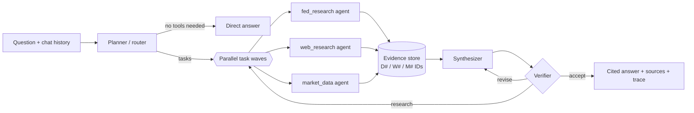

# fedrag — Agentic RAG over Federal Reserve publications

A multi-agent research assistant that answers questions from **93 Federal Reserve Board publications**
(FOMC minutes, Beige Books, Monetary Policy and Financial Stability Reports, stress tests, supervision
reports, annual reports and FEDS working papers, 2022 to September 2026). It also handles questions that
are only partly about those documents, or not at all:

| Question type | What happens |
| --- | --- |
| What a Fed publication says | `fed_research` agent searches, filters, reads pages and tables, and cites them |
| After the collection ends, or outside it | `web_research` agent searches the web and reads pages |
| Live numbers (FX, fed funds, yields, CPI, prices) | `market_data` agent calls FX / FRED / market APIs and a calculator |
| Several of the above | the planner runs several agents in parallel and the writer merges their findings |
| General knowledge or chit-chat | answered directly by the LLM, no tools |

All models are open-weight and self-hosted on a Colab A100 80GB. No proprietary API keys are needed.

## How it works



1. **Planner (router).** Classifies the question, rewrites follow-ups into standalone questions, and
   decomposes the work into self-contained tasks for specialist agents. It is given today's date and a
   description of the collection (which meetings and reports exist), so it knows when the documents
   cannot be enough. It returns a JSON-schema-constrained plan. Comparisons over time become parallel
   tasks (one per meeting or report), and tasks may depend on each other's results.
2. **Specialist agents.** Each one is a ReAct loop over native function calling. In each turn the model
   may call several tools at once; they run concurrently. The agent finishes by calling
   `submit_findings` (answer, cited key facts, confidence, gaps).
   - `fed_research`: `search_fed_documents` (hybrid search with type, date and document filters),
     `find_documents` (which documents discuss a topic), `list_fed_documents` (resolves "latest", "the
     June meeting" and so on), `get_document_outline`,
     `read_document_pages` (whole pages and tables), `expand_context` (neighbouring passages), `calculator`.
   - `web_research`: `web_search` (DuckDuckGo, with news and recency filters), `fetch_webpage`
     (HTML or PDF, query-focused extraction), `calculator`.
   - `market_data`: `get_exchange_rate` and `get_exchange_rate_history` (ECB via Frankfurter, with a
     fallback source), `get_economic_series` (FRED, with year-over-year and difference transforms),
     `search_economic_series`, `get_market_prices` (Yahoo via the local `stockcache`), `calculator`.
3. **Corrective step.** If no agent found any evidence, a web-research task is added automatically.
4. **Synthesizer.** Writes the answer from the findings and the evidence excerpts, with an inline
   citation (`[D3]`, `[W2]`, `[M1]`) on every fact.
5. **Verifier.** Checks support, completeness and date consistency. It returns `accept`, `revise` (the
   synthesizer fixes the listed problems) or `research` (follow-up tasks run, then the answer is
   rewritten).
6. **Output.** The answer, its source list (document citations link to the exact PDF page on
   federalreserve.gov), the plan, every agent's findings and a full trace of tool calls.

### Retrieval

- **Parsing** (`fedrag/ingest/pdf_parser.py`): a layout-aware PyMuPDF extractor. It rebuilds table rows
  from span geometry (`First Citizens | 6.7`), drops chart axis labels and running headers, removes
  footnote markers and fixes hyphenation. Two-column report pages keep their reading order.
- **Sections** (`chunker.py`): every paragraph gets a section path from the PDF outline plus headings
  detected from the font, for example `Federal Reserve Bank of Chicago > Manufacturing`. FOMC minutes
  have no outline, so their standard headings are recognised from formatting.
- **Chunks:** 6,368 overlapping chunks of about 260 words that never cross a top-level section, so a
  Beige Book chunk belongs to exactly one District. Each chunk is embedded with a contextual header
  (document title, date, section).
- **Search** (`fedrag/retrieval/index.py`): metadata filter, then BM25 (sparse matrix) and dense search
  with **Qwen3-Embedding-8B** (4096-d), fused with reciprocal rank fusion, then the top 40 reranked by
  **Qwen3-Reranker-4B**. Without the GPU it falls back to BM25 only.

### Models (all on one A100 80GB)

| Role | Model | Notes |
| --- | --- | --- |
| LLM for every agent | `Qwen/Qwen3.8-27B-FP8` via vLLM 0.30 | tool calling (`qwen3_xml` parser), JSON-schema output, MTP speculative decoding, about 95 tok/s per stream, 64K context, thinking mode off |
| Embeddings | `Qwen/Qwen3-Embedding-8B` | corpus embedded once on the GPU (about 6 min); queries use an instruction prefix |
| Reranker | `Qwen/Qwen3-Reranker-4B` | P("yes") relevance; about 2 s for 40 passages |

Qwen3.8-27B was chosen because it was the strongest instruction-following and agentic model that fits
in 80GB next to the retrieval models (IFBench 79.5, Terminal-Bench 73). FP8 weights run on the A100
through vLLM's Marlin kernels.

## Setup

```bash
# 1. Environment (Python 3.11+)
uv venv --python 3.12 .venv && uv pip install --python .venv/bin/python -e ".[ui,dev]"

# 2. Parse the PDFs into pages, sections and chunks (about 6 s; writes data/corpus/)
.venv/bin/python -m fedrag.ingest.build_corpus

# 3. Start the GPU server on Colab (see COLAB_GUIDE.md for the high-RAM A100 patch).
#    Creates the session, installs vLLM, downloads models, embeds the corpus if data/index/ is missing,
#    starts gateway + vLLM + tunnel, writes FEDRAG_GPU_URL / FEDRAG_API_KEY to .env, then keeps the VM
#    alive while it is used.
.venv/bin/python scripts/colab_up.py          # about 12 min on a fresh VM
.venv/bin/python -m fedrag status             # gateway, LLM and index check
```

`scripts/colab_up.py --stop` releases the VM. `colab_up.py` also works around two Colab behaviours:

- Colab reclaims a VM about 20 minutes after the last kernel execution, even while the servers in the
  background are busy. The keep-alive loop therefore runs a tiny status cell every 4 minutes. It stops
  after 60 minutes without gateway requests, and Colab then releases the VM.
- `colab-cli` 0.6.0 never refreshes its runtime-proxy token, which expires after about an hour. The
  next `exec` gets a 401, and the CLI deletes the session record and kills its keep-alive daemon,
  although the VM is still running (`colab sessions` shows it as `[?]`). The loop refreshes the token on
  every heartbeat through the CLI's own state API, and re-adopts such orphans.

The loop also repairs a dropped tunnel and updates `.env` with the new URL.
`python scripts/colab_up.py --keepalive-only` restarts just the loop.

## Usage

```bash
.venv/bin/python -m fedrag ask "What did the FOMC decide in July 2026, and who dissented?"
.venv/bin/python -m fedrag ask -v --save run.json "..."   # show tool results and save the full trace
.venv/bin/python -m fedrag chat                           # multi-turn, follow-up questions work
.venv/bin/python -m fedrag search "CET1 ratio" --type stress_test   # raw retrieval, no agents
.venv/bin/python -m fedrag.ui.app                         # web UI on http://127.0.0.1:7860
```

The web UI streams every agent as a collapsible panel listing its tool calls and findings, and links each
citation to its source.

Real CLI trace (abridged): three agents run in parallel, each making several tool calls.

```
     planner    6.7s intent=mixed tasks=3 — The question has two parts: (1) the outcome of the September 2026
                     FOMC meeting, which is after the local collection's last minutes ...
                     • web_research t1: Find the outcome of the Federal Reserve's September 2026 FOMC meeting ...
                     • market_data t2: Retrieve the current federal funds target range using FRED series DFEDTARL ...
                     • fed_research t3: In the FOMC minutes for the July 28-29, 2026 meeting, find the target range ...
web_research   10.0s   ↳ web_search({"query": "Federal Reserve FOMC September 2026 meeting federal funds rate decision", ...})
fed_research   10.6s   ↳ search_fed_documents({"query": "federal funds rate target range decision", "doc_types": ["meeting_minutes"], ...})
fed_research   10.7s   ↳ list_fed_documents({"doc_type": "meeting_minutes", "date_from": "2026-07-29", "date_to": "2026-07-29"})
 market_data   10.9s   ↳ get_economic_series({"series_id": "DFEDTARL"})
 market_data   10.9s   ↳ get_economic_series({"series_id": "DFEDTARU"})
 market_data   20.2s   ↳ get_economic_series({"series_id": "DFEDTARU", "start_date": "2026-09-14", "end_date": "2026-09-22"})
web_research   20.3s   ↳ fetch_webpage({"url": "https://www.federalreserve.gov/monetarypolicy/fomcpresconf20260916.htm", ...})
fed_research   21.7s ✔ confidence=high evidence=4 steps=2 tools=2
 market_data   28.7s ✔ confidence=high evidence=8 steps=4 tools=8
web_research   33.0s ✔ confidence=high evidence=10 steps=4 tools=5
 synthesizer   33.0s ▶ write the cited answer
    verifier   ...   verdict=accept
```

## Evaluation

`eval/questions.jsonl` has 32 questions in 7 categories, with reference answers taken from the
documents, from live data on 2026-10-04, or from the web. `eval/run_eval.py` scores:

- **routing:** every expected agent ran and no forbidden agent ran;
- **correctness:** an LLM judge compares the answer with the reference (2 correct, 1 partial, 0 wrong);
- **grounding:** the share of tool-based answers that carry citations;
- **cost:** latency, LLM calls and tool calls.

### Results (final run, 2026-10-04)

The agentic system is compared with a **naive RAG baseline** that uses the same retrieval stack (hybrid
search and reranker) and the same LLM, but makes one retrieval and one LLM call (`run_eval.py --naive`):

| Category | n | Routing | Fully correct: agentic | Fully correct: naive RAG | Median latency* | LLM calls / tool calls |
| --- | ---: | ---: | ---: | ---: | ---: | ---: |
| Fed documents, single fact | 10 | 100% | **90%** | 90% | 64 s | 7.0 / 4.4 |
| Fed documents, multi-document comparison | 4 | 100% | **100%** | 25% | 107 s | 13.8 / 9.5 |
| Live data (FX, FRED, prices) | 4 | 100% | **100%** | 0% | 29 s | 6.0 / 2.2 |
| Web / current events | 4 | 100% | **100%** | 0% | 53 s | 7.0 / 4.5 |
| Mixed (documents + web/data) | 4 | 100% | **100%** | 0% | 108 s | 9.8 / 8.2 |
| General knowledge / chit-chat | 4 | 100% | **100%** | 50% | 7 s | 2.0 / 0.0 |
| Outside the collection | 2 | 100% | **100%** | 0% | 89 s | 12.0 / 9.5 |
| **Overall** | **32** | **100%** | **97%** (mean score 0.98) | 38% (0.47) | 60 s | 7.8 / 5.0 |

\*Measured with 4 questions running at once on one A100. A single question on its own usually takes
20–40 s (documents), 10–30 s (live data), 35–65 s (mixed) or 3–10 s (general knowledge). Every
tool-based answer carried citations. The answers, judge verdicts and full agent traces of both runs are in
`eval/results/final_agentic.jsonl` and `eval/results/final_naive_rag.jsonl`.

What the numbers show:

- Naive RAG does well on single-fact lookups because the retrieval is strong. It fails as soon as a
  question needs several documents (dissents across five FOMC meetings), live numbers, events after the
  collection ends, or no retrieval at all. It names Jerome Powell as the current chair and gives the 2024
  fed funds range as current; it also refuses "What is the capital of Australia?" because the context
  doesn't contain it.
- Every answer in the final run was also checked by hand. All 32 have the correct main answer; the
  single partial score (`fd06`) left out one of four points in the reference. In one comparison answer the agents also
  noticed that the 2026 stress-test report restates the 2025 projected minimum as 11.5% (the 2025 report
  says 11.6%), and reported both.
- Earlier runs showed that the LLM judge "corrects" 2026 facts with its outdated training knowledge (for
  example insisting Powell is chair). The judge prompt now says its knowledge is outdated, and judging
  runs in thinking mode.

The development history, including the regressions found and fixed, is in the git log.

```bash
.venv/bin/python eval/run_eval.py -c 4              # all questions
.venv/bin/python eval/run_eval.py --ids fd01 mx02   # a subset
.venv/bin/python -m pytest -q                       # offline unit tests (parser, chunker, BM25, tools)
```

## Configuration (`.env` or environment)

| Variable | Default | Purpose |
| --- | --- | --- |
| `FEDRAG_GPU_URL`, `FEDRAG_API_KEY` | written by `colab_up.py` | GPU gateway (LLM, embeddings, rerank) |
| `FEDRAG_LLM_BASE_URL`, `FEDRAG_LLM_API_KEY`, `FEDRAG_LLM_MODEL` | gateway, `qwen3.8-27b` | any OpenAI-compatible LLM endpoint |
| `FEDRAG_LLM_THINKING_FLAG` | `1` | send Qwen's `enable_thinking`; set to `0` for other backends |
| `FEDRAG_HTTP_CONTACT` | empty | contact info added to the web User-Agent (Wikimedia requires one) |
| `FEDRAG_LLM_GPU_UTIL`, `FEDRAG_LLM_MAX_LEN`, `FEDRAG_LLM_MTP` | `0.62`, `65536`, `1` | vLLM settings (on the VM) |

## Repository layout

```
fedrag/
  ingest/        pdf_parser.py (layout-aware extraction), chunker.py (sections + chunks), build_corpus.py
  retrieval/     bm25.py, index.py (hybrid search, filters, navigation), text_format.py
  tools/         fed_docs.py, web.py, market.py, base.py (Tool, RunContext)
  agents/        base.py (ReAct ToolAgent), planner.py, specialists.py, writer.py (synth/verify), prompts.py
  orchestrator.py  the pipeline;  evidence.py  citation registry;  llm.py  OpenAI-compatible client
  cli.py, ui/app.py
gpu_server/      models.py, embed_corpus.py, gateway.py (FastAPI: auth, embeddings, rerank, LLM proxy),
                 launch.py (vLLM + gateway + tunnel), setup_vm.py
scripts/         colab_up.py
eval/            questions.jsonl, run_eval.py
tests/           offline unit tests
federal_reserve/ the source PDFs (not in git; metadata.csv lists their URLs)
```

## Notes and limitations

- The gateway is reachable through a Cloudflare quick tunnel protected by a random bearer token. The
  URL changes whenever the tunnel restarts; `colab_up.py` keeps `.env` current.
- `data/` (corpus and embeddings) is generated, not committed: run step 2, and step 3 embeds on first use.
- Web pages that block bots (paywalls, Wikipedia without `FEDRAG_HTTP_CONTACT`) cannot be fetched. The
  web agent then relies on search snippets and other sources.
- FRED data and ECB rates have publication lags; the data agent reports as-of dates.
- The LLM judge is the same model as the agents, so its scores are a guide; read the per-question
  outputs in `eval/results/final_*.jsonl` as well.
