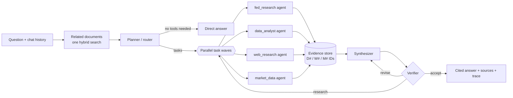

# Architecture

How a question becomes a cited answer, and how the collection is ingested, indexed and served. The [README](../README.md) has the overview; [evaluation.md](evaluation.md) has the measurements.

## The pipeline



1. **Planner (router).** Classifies the question, rewrites follow-ups into standalone questions, and
   decomposes the work into self-contained tasks for specialist agents. It is given today's date, a compact
   description of the collection (types, formats, dates, speakers) and of the main datasets, so it knows
   which agent owns which part and when the collection cannot be enough. It returns a
   JSON-schema-constrained plan. Comparisons over time become parallel tasks, and tasks may depend on each
   other's results. Before planning, one hybrid search lists the 12 documents most related to the question,
   so tasks name the reports, speeches and notes that actually discuss the topic; for what "the Fed" says,
   the official voices come first (FOMC statements and projections, the Chair, the Board's reports), then
   Governors' speeches and staff research. For an ambiguous question ("the last meeting", "the current
   rate", a bare "Who dissented?") the planner records how it reads it (`assumptions`, e.g. "'last meeting' =
   the September 15-16, 2026 FOMC meeting"); relative words such as "recently" mean the most recent items
   available, never a fixed window.
2. **Specialist agents.** Each one is a ReAct loop over native function calling. In each turn the model
   may call several tools at once; they run concurrently. The agent finishes by calling
   `submit_findings` (answer, cited key facts, confidence, gaps).
   - `fed_research`: `search_fed_documents` (hybrid search with type, date and document filters, at most
     two passages per document; it also points to related data tables), `search_each_document` (one query
     inside every document of a set, such as each FOMC statement of 2025 or every 2024 Beige Book, so no
     member is crowded out), `find_documents` (which documents discuss a topic),
     `list_fed_documents` (resolves "latest", "the June meeting", "Waller's speeches" and so on),
     `get_document_outline`, `read_document_pages` (whole pages of a PDF, ~600-word parts of a web page or
     Word file, a table preview of a spreadsheet), `expand_context` (neighbouring passages), `calculator`.
   - `data_analyst`: `search_tables` (finds tables by what they measure), `list_tables` (the sheets of a
     workbook, the tables of a page), `describe_table` (columns, units, notes, row labels, header values,
     first rows), `query_data` (read-only DuckDB SQL), plus document search and page reading for
     definitions (the SPF variable codes are only explained in its PDF documentation) and `calculator`.
   - `web_research`: `web_search` (DuckDuckGo, with news and recency filters), `fetch_webpage`
     (HTML or PDF, query-focused extraction), `calculator`.
   - `market_data`: `get_exchange_rate` and `get_exchange_rate_history` (ECB via Frankfurter, with a
     fallback source), `get_economic_series` (FRED, with year-over-year and difference transforms),
     `search_economic_series`, `get_market_prices` (Yahoo via the local `stockcache`), `calculator`.
3. **Corrective step.** If no agent found any evidence, a web-research task is added automatically.
4. **Synthesizer.** Writes the answer from the findings and the evidence excerpts, with an inline
   citation (`[D3]`, `[W2]`, `[M1]`) on every fact. It states the planner's interpretation of an ambiguous
   question first, covers every member of a set (or says which ones the evidence lacks), organizes broad
   answers by theme and source, and shows conflicting figures side by side with their sources. A SQL result is evidence too: the writer and the
   verifier see the query and its rows, and the source list names the table and its document.
5. **Verifier.** Checks support, completeness (every member of a set; a stated interpretation), date
   consistency and arithmetic. It returns `accept`,
   `revise` (the synthesizer fixes the listed problems) or `research` (follow-up tasks run, then the answer
   is rewritten).
6. **Output.** The answer, its source list (PDF citations link to the exact page; web pages, Word files
   and data files to their source URL), the plan, every agent's findings and a full trace of tool calls.

## The collection

[`federal_reserve/README.md`](../federal_reserve/README.md) describes it in detail: 151 PDFs, 550 web pages, 2 Word files, 5 Excel
workbooks (310 sheets, 36 of them charts) and 17 CSV files; 721 from the Board, 4 from the New York and
Philadelphia Feds. Speeches, FEDS Notes and press releases cover 2025-2026, press conferences and Beige
Books 2023-2026 and minutes 2022-2026, so questions can span several years and many sources.
`scripts/fetch_corpus.py --discover` crawled the Board's indexes (press releases, speeches, testimony,
FEDS Notes, SR letters, SLOOS, the FOMC calendar, the Beige Book archive) and a curated list of data files
to grow the original 93 PDFs; `metadata.csv` records each file's URL, SHA-256, format, publisher, speaker and, for data files whose
columns are codes, a short data dictionary.

## Ingestion (`fedrag/ingest/`)

Each format has its own parser; all of them produce the same structure (pages of typed paragraphs, an
outline, table blocks), so sectioning, chunking, retrieval and citation work the same way for every file.

- **PDF** (`pdf_parser.py`): a layout-aware PyMuPDF extractor. It rebuilds table rows from span geometry
  (`First Citizens | 6.7`), drops chart axis labels and running headers, removes footnote markers and
  fixes hyphenation. Two-column report pages keep their reading order.
- **Web pages** (`html_parser.py`): finds the article in both federalreserve.gov templates, removes
  navigation, share and video widgets and "Related Content" lists, keeps headings, lists and footnotes in
  reading order, and expands every `<table>` (colspan, rowspan, `<thead>` header rows) into a grid whose
  caption is the preceding "Table N." heading.
- **Word** (`docx_parser.py`): paragraph styles give headings and bullets, tables of contents are dropped,
  tables are read in place. The SCF interview program keeps its routing logic in thousands of one-cell
  code boxes, which are skipped; its answer-category tables become text.
- **Excel and CSV** (`sheet_parser.py`, `tables.py`): chart sheets and license sheets are skipped and
  merged cells are expanded. A table engine then finds each table block on a sheet: title, unit and
  source lines above it, header rows (a label spanning several columns, such as a survey year over
  "Median | Mean", is spread over them), row groups introduced by label-only rows ("Percentile of income"),
  continuation blocks, and notes below. A one-row header gives a **wide** table; a multi-row header gives a
  **long** table (`row_group, row_label, h1..hN, value, value_text`) so that every dimension of a cross-tab
  can be filtered in SQL. Date-like row labels (`26:Q2`, `201306`, year + quarter columns) get a normalised
  `period` column, and repeated labels such as "June projection" are qualified with the row above.
- **Pages and parts.** PDFs keep their pages. Web pages and Word files are split into parts of about
  600 words that break at headings; a spreadsheet has one part per table. Citations say "p. 12" or
  "part 3" accordingly.
- **Sections and chunks** (`chunker.py`): every paragraph gets a section path from the outline plus
  headings detected from the font or markup, for example `Federal Reserve Bank of Chicago > Manufacturing`.
  Chunks of about 260 words never cross a top-level section, so a Beige Book chunk belongs to exactly one
  District: 14,770 prose chunks in all.
- **Tables** (`build_corpus.py`): the 978 table blocks become DuckDB tables, and 20 views stack a table
  that recurs across releases (SEP Table 1 for all 15 meetings since March 2023, stress-test scenarios for
  2024-2026) with `doc_id` and `doc_date` columns. Each table also gets a **table card** for retrieval: its
  title, source, columns with labels and examples, units and notes, the data dictionary, row labels or
  period range, and for small tables the rows themselves (998 cards).

## Retrieval and SQL (`fedrag/retrieval/`)

- **Search** (`index.py`): metadata filter (type, date, document, chunk kind, format), then BM25 (sparse
  matrix) and dense search with **Qwen3-Embedding-8B** (4096-d), fused with reciprocal rank fusion, then
  the top 40 reranked by **Qwen3-Reranker-4B**. Without the GPU it falls back to BM25 only. Document search
  returns prose passages and lists matching table cards as pointers; table search ranks only cards.
- **Embeddings are incremental**: vectors are keyed by the hash of the text they embed, so rebuilding
  the corpus re-embeds only new or changed chunks (growing from 10,441 to 15,768 chunks embedded only the
  5,327 new ones, in about 6 minutes). `colab_up.py` runs the batch job for large updates; with the
  gateway already running, `python -m fedrag.retrieval.index embed-missing` embeds a few changed chunks
  through it in seconds.
- **SQL** (`tables.py`): DuckDB opened read-only, with external access disabled and the configuration
  locked, so a query can read the collection's tables and nothing else (no files, network, settings or
  writes). One statement per call, a 20-second timeout and a row cap; DuckDB's error messages go back to
  the agent so it can fix its query.

## Models (all on one A100 80GB)

| Role | Model | Notes |
| --- | --- | --- |
| LLM for every agent | `Qwen/Qwen3.8-27B-FP8` via vLLM 0.31 | tool calling (`qwen3_xml` parser), JSON-schema output, MTP speculative decoding, about 95 tok/s per stream, 64K context, thinking mode off |
| Embeddings | `Qwen/Qwen3-Embedding-8B` | chunks embedded on the GPU once, then only new or changed ones (4,073 new chunks: about 5 min); queries use an instruction prefix |
| Reranker | `Qwen/Qwen3-Reranker-4B` | P("yes") relevance; about 2 s for 40 passages |

Qwen3.8-27B was chosen because it was the strongest instruction-following and agentic model that fits
in 80GB next to the retrieval models (IFBench 79.5, Terminal-Bench 73). FP8 weights run on the A100
through vLLM's Marlin kernels.

## Repository layout

```
fedrag/
  ingest/        pdf_parser.py, html_parser.py, docx_parser.py, sheet_parser.py (one per format),
                 tables.py (grid -> table blocks -> wide/long tables), document.py (parts), chunker.py,
                 build_corpus.py (pages, chunks, table cards, DuckDB tables and views)
  retrieval/     bm25.py, index.py (hybrid search, filters, cards, incremental embeddings),
                 tables.py (sandboxed DuckDB access), text_format.py
  tools/         fed_docs.py, data_tools.py (SQL tools), web.py, market.py, base.py (Tool, RunContext)
  agents/        base.py (ReAct ToolAgent), planner.py, specialists.py, writer.py (synth/verify), prompts.py
  orchestrator.py  the pipeline;  evidence.py  citation registry;  llm.py  OpenAI-compatible client
  cli.py         fedrag ask / chat / search / tables / sql / ui
  ui/            app.py (explorer server: runs the pipeline, streams its trace as NDJSON, saves runs),
                 static/ (the page: pipeline graph, timeline, inspector; no build step)
gpu_server/      models.py, embed_corpus.py, gateway.py (FastAPI: auth, embeddings, rerank, LLM proxy),
                 launch.py (vLLM + gateway + tunnel + keeper), keeper.py, setup_vm.py
scripts/         fetch_corpus.py (discover + download the collection), colab_up.py (Colab bring-up),
                 switch_llm.py (serve another LLM on the running VM),
                 colab_keepalive.py (heartbeat + token refresh)
eval/            questions.jsonl (52), questions_hard.jsonl (24 multi-source, ambiguous, broad),
                 run_eval.py, compare.py (runs side by side)
tests/           offline unit tests
docs/            architecture.md, evaluation.md, setup.md, findings.md (log of measurements, failures
                 and fixes), images/ (screenshots)
federal_reserve/ the source files (not in git; metadata.csv lists their URLs and hashes)
```
