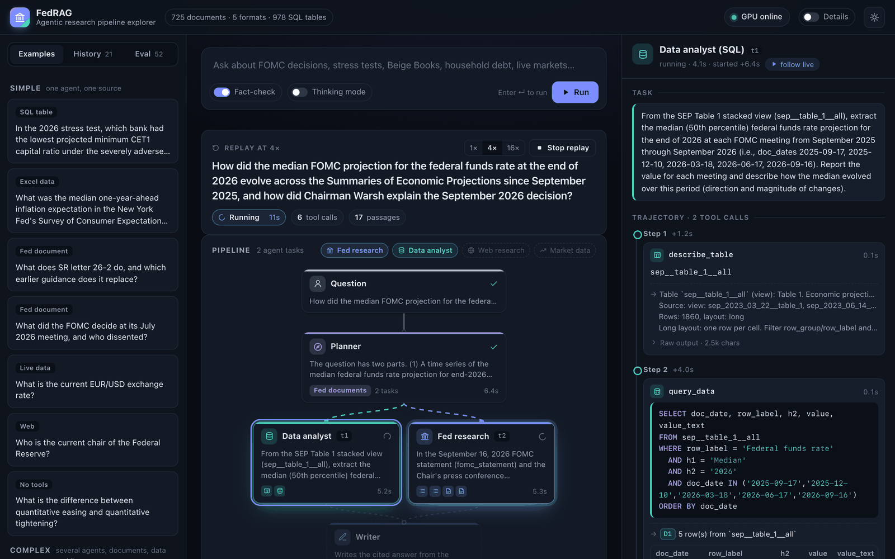

# Setup and usage

Running fedrag yourself: the environment, the collection, the GPU backend on Colab, the command line, the pipeline explorer and the configuration.

## Setup

```bash
# 1. Environment (Python 3.11+)
uv venv --python 3.12 .venv && uv pip install --python .venv/bin/python -e ".[ui,dev]"

# 2. Download the collection (725 files, 269 MB; checks each SHA-256 in federal_reserve/metadata.csv)
.venv/bin/python scripts/fetch_corpus.py            # --discover also looks for new documents

# 3. Parse every document into pages, sections, chunks and SQL tables (about 20 s; writes data/corpus/)
.venv/bin/python -m fedrag.ingest.build_corpus

# 4. Start the GPU server on Colab (see COLAB_GUIDE.md for the high-RAM A100 patch).
#    Creates the session, installs vLLM, downloads models, embeds the chunks that have no embedding yet,
#    starts gateway + vLLM + tunnel + keeper, writes FEDRAG_GPU_URL / FEDRAG_API_KEY to .env, and leaves
#    a heartbeat running in the background.
.venv/bin/python scripts/colab_up.py          # 13-20 min on a fresh VM (20 with 4,073 chunks to embed)
.venv/bin/python -m fedrag status             # gateway, LLM and index check
```

`scripts/colab_up.py --stop` ends the heartbeat and releases the VM. `--status` shows the serving
stack, the keeper and the heartbeat.

Keeping a Colab VM alive needed measurements (data in
[COLAB_GUIDE.md](../COLAB_GUIDE.md#why-sessions-die-and-how-to-keep-them-alive)):

- Colab releases a GPU VM 20-22 minutes after the last kernel-websocket traffic through its proxy.
  Busy servers on the VM do not count, and neither do a busy kernel, HTTP requests through the proxy or
  the CLI's own keep-alive pings. A websocket that the VM opens to its own kernel through its public
  proxy URL does count, so `gpu_server/keeper.py` holds one while the gateway is in use. The VM
  therefore survives the laptop sleeping. After 60 minutes without gateway requests (`--idle-minutes`)
  the keeper lets go, and Colab releases the VM about 20 minutes later.
- `colab-cli` 0.6.0 never refreshes its runtime-proxy token, which expires after an hour. The next
  `colab exec` then gets a 401, and the CLI forgets the session although the VM keeps running.
  `scripts/colab_keepalive.py` refreshes the token before it expires and re-adopts a VM that the CLI
  has already dropped.
- The background heartbeat runs the status cell every 4 minutes. It restarts crashed components,
  hands the keeper fresh tokens, updates `.env` when the tunnel URL changes, and is a second keep-alive
  path. `colab_up.py --keepalive-only` restarts it; its log is `~/.cache/colab-keepalive/fedrag.log`.

For other colab-cli sessions, `python scripts/colab_keepalive.py -s NAME --detach` runs the same
heartbeat and token refresh (without the keeper).

## Usage

```bash
.venv/bin/python -m fedrag ask "What did the FOMC decide in July 2026, and who dissented?"
.venv/bin/python -m fedrag ask -v --save run.json "..."   # show tool results and save the full trace
.venv/bin/python -m fedrag chat                           # multi-turn, follow-up questions work
.venv/bin/python -m fedrag search "CET1 ratio" --type stress_test   # raw retrieval, no agents
.venv/bin/python -m fedrag tables household_debt          # list SQL tables (add --describe NAME for a schema)
.venv/bin/python -m fedrag sql "SELECT period, total FROM nyfed_household_debt_2026q2__page_3_data ORDER BY period DESC LIMIT 4"
.venv/bin/python -m fedrag ui                             # pipeline explorer on http://127.0.0.1:7860
```

## Pipeline explorer (web GUI)

`fedrag ui` serves a page where you type a question, or pick one of 18 examples (simple ones need one agent and
one source, complex ones several agents and formats), and watch the pipeline run:



- **Pipeline graph**: the planner, each agent task it creates (parallel tasks side by side, dependent tasks
  below their inputs), the writer, the fact-checker and the answer. Running steps glow and the edges into
  them animate; a web fallback, a research round or a revision adds its own row.
- **Timeline**: when each step ran, with tool calls as solid segments, so parallel work and LLM time show.
- **Inspector**: click any step. An agent shows its task and every tool call grouped by step: search queries
  and filters, SQL (highlighted) with its result table, pages read, web pages, data series. Each call lists
  the passages it returned, and the agent's findings follow, with confidence and gaps. The planner shows its
  reasoning and tasks; the fact-checker shows its verdict and issues.
- **Answer**: streams in while the writer types. Each citation is a chip: hover to preview the passage, click
  to read it in full (for a SQL result, the query and its rows) and see which agent retrieved it.

Every run is saved to `data/ui_runs/`: the History tab reopens it, and Replay animates it again at 1×, 4× or
16× speed. The Eval tab opens the 52 evaluation runs with the judge's score and the reference answer, so the
explorer is useful while the GPU is off. Options: fact-checking on or off, thinking mode for the specialist
agents, and follow-up questions that send the previous turns to the planner. The **Details** switch in the
top bar adds to every step what is executing: the LLM and its role, or each running tool and the service
behind it (BM25 + embedder + reranker for search, DuckDB for SQL, FRED, ECB, Yahoo, DuckDuckGo). The server reads `.env` when it
checks the GPU, so it picks up the new tunnel address after `scripts/colab_up.py` restarts the backend.

Real trace (abridged, question `cf01` in `eval/results/final_agentic.jsonl`): a cross-format question. The
planner gives the Bulletin (PDF) to `fed_research` and the Excel tables to `data_analyst`; they run in
parallel, and the SQL result is cited like a page.

```
     planner    9.4s intent=fed_documents tasks=2 — The question asks for two specific data points from the SCF ...
                     • fed_research t1: In the document 'Changes in U.S. Family Finances from 2019 to 2022' ...
                     • data_analyst t2: Query the SCF historical tables in 2022 dollars ...
fed_research   15.8s   ↳ search_fed_documents({"query": "median family net worth 2019 2022 change", "doc_types": ["household_survey"]})
data_analyst   15.9s   ↳ search_tables({"query": "median family net worth by year Survey of Consumer Finances", "max_tables": 10})
data_analyst   15.9s   ↳ list_tables({"title_contains": "net worth"})
data_analyst   31.4s   ↳ describe_table({"table": "scf_2022_hist_tables_real__table_4"})
fed_research   34.9s   ↳ get_document_outline({"doc_id": "fed_scf_bulletin_2023-10"})
data_analyst   36.6s   ↳ query_data({"sql": "SELECT row_group, row_label, h1, h2, value, value_text FROM scf_2022_hist_tables_real__table_4 WHE…"})
data_analyst   45.0s   ↳ calculator({"expression": "(192.7 - 141.14) / 141.14 * 100"})
fed_research   49.4s   ↳ read_document_pages({"doc_id": "fed_scf_bulletin_2023-10", "start_page": 17, "end_page": 19})
data_analyst   57.2s ✔ confidence=high evidence=1 steps=5 tools=6
fed_research   62.3s ✔ confidence=high evidence=3 steps=5 tools=6
 synthesizer   62.3s ▶ write the cited answer
    verifier   78.7s verdict=accept
```

> Median family net worth rose from $141,100 in 2019 to $192,900 in 2022, a 37 percent increase, according
> to the October 2023 SCF Bulletin [D8][D9]. The SCF historical Excel tables in 2022 dollars show a very
> similar comparison: $141,140 in 2019 and $192,700 in 2022, a 36.53 percent increase [D7]. ...

## Configuration (`.env` or environment)

| Variable | Default | Purpose |
| --- | --- | --- |
| `FEDRAG_GPU_URL`, `FEDRAG_API_KEY` | written by `colab_up.py` | GPU gateway (LLM, embeddings, rerank) |
| `FEDRAG_LLM_BASE_URL`, `FEDRAG_LLM_API_KEY`, `FEDRAG_LLM_MODEL` | gateway, `qwen3.8-27b` | any OpenAI-compatible LLM endpoint |
| `FEDRAG_LLM_THINKING_FLAG` | `1` | send Qwen's `enable_thinking`; set to `0` for other backends |
| `FEDRAG_HTTP_CONTACT` | empty | contact info added to the web User-Agent (Wikimedia requires one) |
| `FEDRAG_LLM_GPU_UTIL`, `FEDRAG_LLM_MAX_LEN`, `FEDRAG_LLM_MTP` | `0.62`, `65536`, `1` | vLLM settings (on the VM) |

## Notes and limitations

- The gateway is reachable through a Cloudflare quick tunnel protected by a random bearer token. The
  URL changes whenever the tunnel restarts; `colab_up.py` keeps `.env` current.
- `data/` (corpus, tables and embeddings) is generated, not committed: run steps 2-3, and step 4 embeds
  what is missing.
- The table engine is heuristic. It handles the layouts in this collection (multi-row merged headers,
  row groups, notes, chart sheets, stacked blocks); a few complex sheets (parts of the stress-test market
  shock workbook) come out with generic column names, and their text preview stays readable. Tables inside
  PDFs are extracted as text rows, not as SQL tables; the same data are in the CSV files where it matters
  (bank-level stress-test results).
- Speeches, FEDS Notes and press releases cover 2025-2026; press conferences, Beige Books, FOMC statements
  and SEPs 2023-2026; minutes 2022-2026.
- Web pages that block bots (paywalls, Wikipedia without `FEDRAG_HTTP_CONTACT`) cannot be fetched. The
  web agent then relies on search snippets and other sources.
- FRED data and ECB rates have publication lags; the data agent reports as-of dates.
- The LLM judge is the same model as the agents, so its scores are a guide; read the per-question
  outputs in `eval/results/final_*.jsonl` as well.
